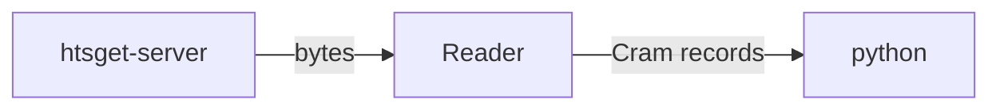

# htslurp

>[!WARNING]
> This is an experiment and the code is in a not-working state.

Attempt at making a noodles-based htsget client that can lazily deserialize records in memory. The aim is to provide a simple rust API with python bindings.

## Context

The aim of this project is to provide a convenient interface to consume remote CRAM/BCF records over the network without storing them locally.

The noodles crate is used to fetch a binary stream from a server and construct a reader over it that can lazily instantiate records.



## Development

This project requires:
* a working rust (>=1.76) and python (>=3.10) installation
* [maturin](https://github.com/PyO3/maturin)
* [uv](https://github.com/astral-sh/uv)
* [just](https://github.com/casey/just)

To build the python package:

```sh
just build
```

To install the project in installable mode:
```sh
just develop
```
